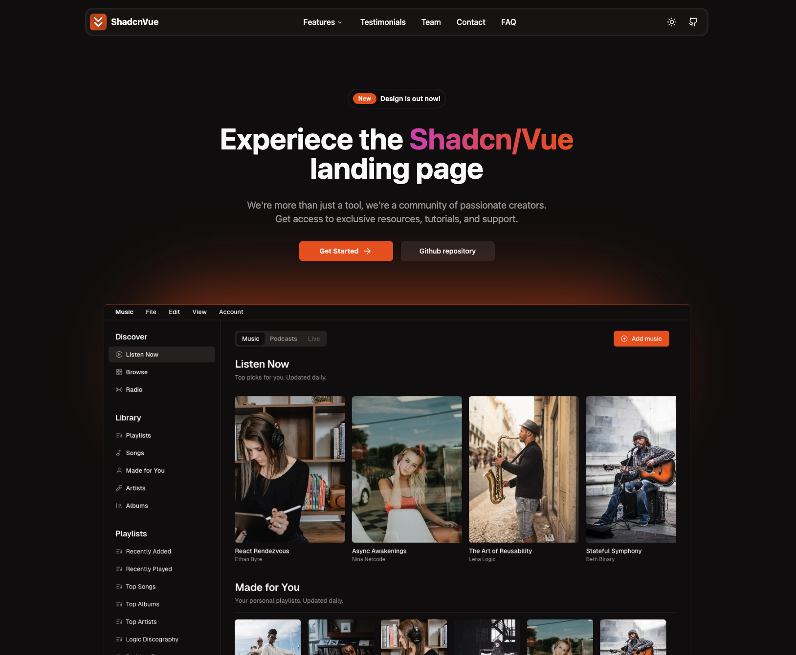

# Shadcn/Vue Landing Page Template

## <a href="https://www.shadcn-vue.com/" target="_blank">Shadcn-Vue</a> + <a href="https://vuejs.org/" target="_blank">Vue.js</a> + <a href="https://www.typescriptlang.org/" target="_blank">TypeScript</a> + <a href="https://tailwindcss.com/" target="_blank">Tailwind</a>.


Live demo is now available: <a href="shadcn-vue-landing-page.vercel.app" target="_blank">Live Demo</a>

## Sections

- [x] Navbar
- [x] Sidebar(mobile)
- [x] Hero
- [ ] ... more sections coming soon

## Features

- [x] Fully Responsive Design
- [x] User Friendly Navigation
- [x] Dark Mode

## How to install

1. Clone this repositoy:

```bash
git clone https://github.com/leoMirandaa/shadcn-vue-landing-page.git
```

2. Go into project

```bash
cd shadcn-vue-landing-page
```

3. Install dependencies

```bash
npm install
```

4. Run project

```bash
npm run dev
```
